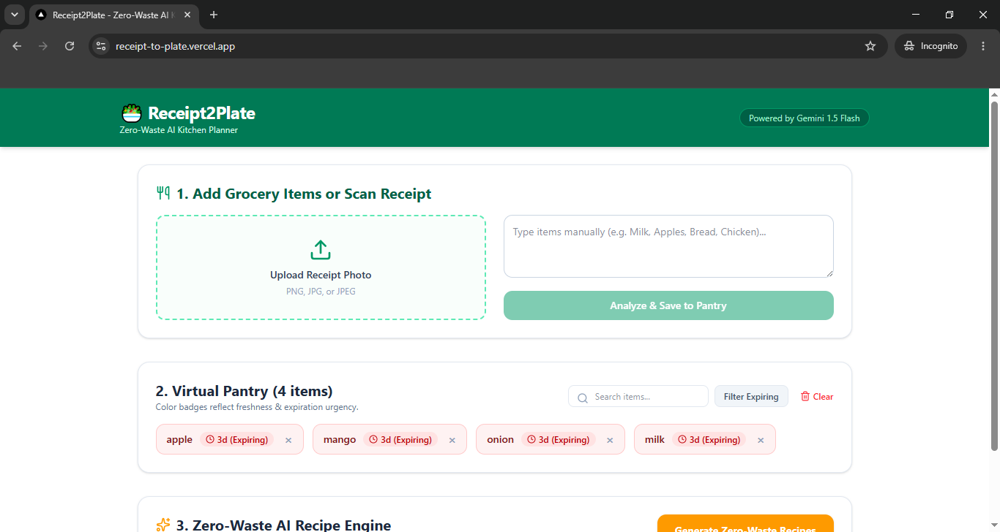
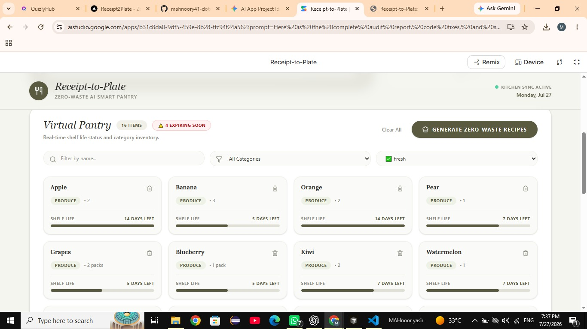
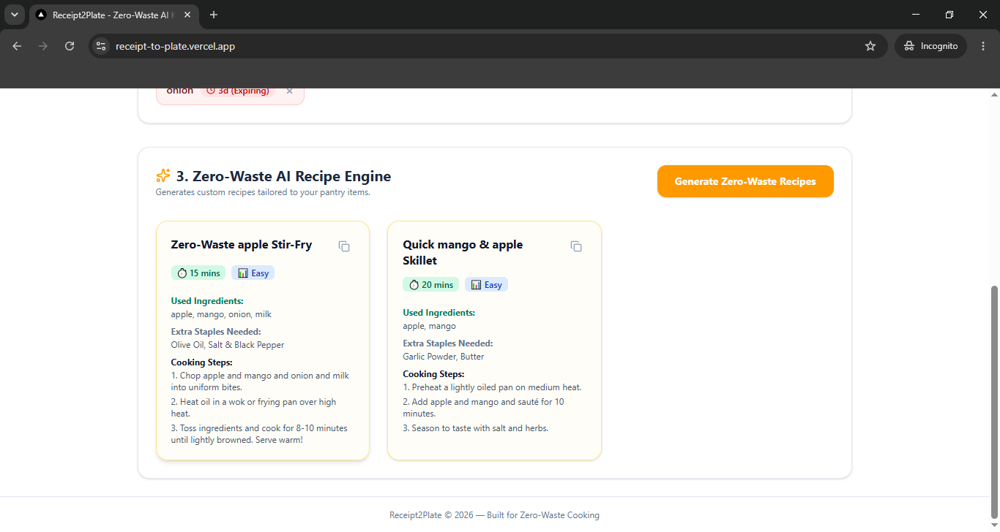

# 🍳 Receipt-to-Plate: AI Zero-Waste Smart Pantry & Recipe Generator

An AI-powered full-stack web application that helps users reduce household food waste by converting grocery receipts into a smart virtual pantry and generating recipes based on available ingredients.

---

# 🚀 Live Demo

**Live App:** [https://receipt-to-plate.vercel.app/](https://receipt-to-plate.vercel.app/)

**GitHub Repository:** [https://github.com/mahnoory41-dotcom/receipt-to-plate](https://github.com/mahnoory41-dotcom/receipt-to-plate)

---

# 📖 Problem Statement

Many households buy groceries but forget what they already have or when items are about to expire. This often leads to unnecessary food waste and extra spending.

---

# 💡 Solution

Receipt-to-Plate uses Google Gemini AI to analyze grocery receipts or manual pantry entries, organize ingredients into a virtual pantry with estimated shelf-life tracking, and recommend recipes that prioritize ingredients close to expiry.

This helps users:

- Reduce food waste

- Save money

- Keep track of groceries

- Cook meals using existing ingredients

---

# ✨ Features

- 📸 AI Receipt Processing using Google Gemini

- ✍️ Manual Pantry Entry

- 🥫 Smart Virtual Pantry

- 🔍 Real-time Search

- 🟢 Freshness & Expiry Badges

- 🤖 AI Recipe Generator

- 📋 One-click Copy Recipe

- 💾 Local Storage Persistence

- 📱 Responsive Design

- ⚡ Loading States

- ❌ Error Handling

---

# 🤖 AI Feature

The application uses **Google Gemini AI** for two main tasks:

### 1. Receipt Analysis

The AI extracts grocery items from uploaded receipts or pasted text.

### 2. Recipe Generation

The AI creates recipes using only ingredients available in the user's pantry while prioritizing ingredients that are closest to expiration.

---

# 🧠 Gemini System Prompt

Example system prompt used:

```text

You are an intelligent pantry assistant.

Analyze grocery receipts and extract grocery items.

For every item identify:

- Item Name

- Quantity (if available)

- Estimated Shelf Life

- Category

Store these items in a virtual pantry.

Generate recipes that prioritize ingredients close to expiry.

Only use available pantry ingredients whenever possible and aim to minimize food waste.

```

---

# 🛠 Tech Stack

### Frontend

- Next.js

- React

- TypeScript

- Tailwind CSS

### AI

- Google Gemini API

### Storage

- Browser LocalStorage

### Deployment

- Vercel

---

# 📂 Folder Structure

```

app/

components/

lib/

public/

styles/

[README.md](http://README.md)

```

---

# # ## 📸 Screenshots

### Dashboard



### Pantry




### AI Recipes



# ⚙️ Environment Variables

Create a `.env.local` file.

```

GEMINI_API_KEY=YOUR_API_KEY
```

Never commit API keys to GitHub.

---

# ▶️ Installation

```bash

git clone [https://github.com/mahnoory41-dotcom/receipt-to-plate.git](https://github.com/mahnoory41-dotcom/receipt-to-plate.git)

cd receipt-to-plate

npm install

npm run dev

```

---

# 🌐 Deployment

The application is deployed on **Vercel**.

Any new commits pushed to the main branch automatically trigger a new deployment.

---

# 🔮 Future Improvements

- Barcode Scanner

- Nutrition Analysis

- Shopping List Generator

- User Authentication

- Cloud Database

- Weekly Meal Planner

- Favorite Recipes

---

# 👨‍💻 Author

Mahnoor Yasir

BS Computer Science

---

# 📄 License

This project was developed as an educational final project.

MIT License.
